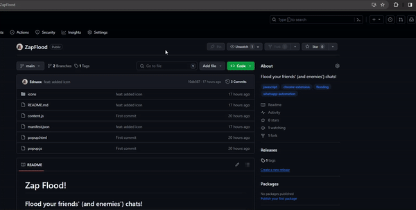
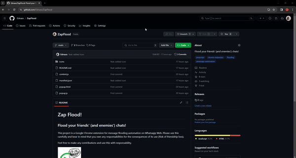

# Zap Flood!

## Flood your friends' (and enemies') chats!

This project is a Google Chrome extension for message flooding automation on Whatsapp Web. Please use this carefully and bear in mind that you own any responsabilities for the consequences of its use (Risk of friendship loss). 

Use this with responsability and feel free to make any contributions.


## Installation guide.

### Clone this repo or download the zip file

On the main github page, click on the green ***Code*** button and clone it or download it. Whichever way you prefer. Then, unzip the file on the directory of your preference.



### On google chrome, go to the extensions screen and load the unpacked extension.

You can do this by visiting ```chrome://extensions```. Make sure to activate the 'Developer mode' at the top-right corner. Then just click at the 'Load unpacked' button and select the project folder.



The extension will be available for use at your browser's top right corner. Keep in mind that so far, you must have your Whatsapp Web logged and a contact selected for the extension to work.

There you go! Now you are ready to flood your friends (and enemies).

## Contributors

<!-- readme: collaborators,contributors -start -->
<table>
<tr>
    <td align="center">
        <a href="https://github.com/rafinhaLQ">
            
            <br />
            <sub><b>Rafael Luz</b></sub>
        </a>
    </td>
    <td align="center">
        <a href="https://github.com/JGaaaabs">
            
            <br />
            <sub><b>João Gabriel Lofiego</b></sub>
        </a>
    </td>
    <td align="center">
        <a href="https://github.com/Ednaxx">
            
            <br />
            <sub><b>Alexandre Morais</b></sub>
        </a>
    </td></tr>
</table>
<!-- readme: collaborators,contributors -end -->
